<a href="https://wallacewambulwa-gilt.vercel.app/"/>
<h1 align="center">
  
</h1>

  

<h3 align="center">🚀 Passionate Backend Software Engineer | Full Stack Developer | UI/UX Designer</h3>

  
  

---

## 🎯 About Me

I'm a passionate software engineer seeking challenging roles as a **Backend Software Engineer** to leverage my technical expertise and problem-solving skills. With a strong foundation in both frontend and backend development, I love creating innovative solutions that make a difference.

- 🔭 I'm currently working on **Custom VPN Solutions & E-Learning Platforms**
- 🌱 I'm currently exploring **Networking and Reverse Engineering**
- 👯 I'm looking to collaborate on **Open Source Projects**
- 💬 Ask me about **Backend Development, System Architecture, and UI/UX Design**
- 📫 How to reach me: **wallacewambulwa@gmail.com**
- ⚡ Fun fact: **I love solving complex problems and building user-centered solutions**

---

## 🛠️ Technical Skills

### Languages

  
  
  
  
  
  

### Frontend Development

  
  
  
  

### Mobile Development

  
  

### Backend Development & Cloud

  
  
  
  
  

### Tools & Technologies

  
  
  
  

---

## 💼 Professional Experience & Roles

| Role | Experience | Focus Area |
|------|------------|------------|
| 🖥️ **Backend Developer** | Building robust server-side applications | API Development, Database Design |
| 🎨 **Frontend Designer** | Creating responsive user interfaces | React, JavaScript, CSS |
| 🎯 **UI/UX Designer** | Designing user-centered experiences | Figma, User Research |
| 📋 **Project Manager** | Leading cross-functional teams | Agile, Scrum, Team Leadership |
| 🚀 **Project Lead** | Driving project vision and execution | System Architecture, Technical Strategy |

---

## 🌟 Featured Projects

<table>
<tr>
<td width="50%">

### 🤝 Freelancing Platform
**Tech Stack:** React, Node.js, MySQL, Express.js

A comprehensive platform enabling seamless connection between clients and freelancers with project management capabilities.

**Key Features:**
- User authentication & profiles
- Project collaboration tools
- Payment integration
- Real-time messaging

</td>
<td width="50%">

### 🔐 Custom VPN Solution
**Tech Stack:** Python, Node.js, AWS, Networking

Engineered a secure VPN solution focusing on robust security to ensure user privacy and secure internet access.

**Key Features:**
- End-to-end encryption
- Multi-server support
- User-friendly interface
- Performance optimization

</td>
</tr>
<tr>
<td width="50%">

### 📚 E-Learning Platform
**Tech Stack:** React, Firebase, Node.js, CSS

Built a highly interactive and user-friendly platform to enhance online education experiences.

**Key Features:**
- Interactive course content
- Progress tracking
- Video streaming
- Assessment tools

</td>
<td width="50%">

### 💳 Billing Systems
**Tech Stack:** Java, MySQL, Express.js

Designed a streamlined billing system for an ISP, prioritizing accuracy and automation.

**Key Features:**
- Automated billing cycles
- Payment processing
- Usage tracking
- Reporting dashboard

</td>
</tr>
<tr>
<td colspan="2">

### ✈️ Online Reservation System
**Tech Stack:** React, Node.js, MySQL, Payment APIs

Created a comprehensive flight booking system allowing users to book flights across multiple destinations with reliability focus.

**Key Features:** Multi-destination booking • Real-time availability • Payment processing • Booking management

</td>
</tr>
</table>

---

## 📊 GitHub Statistics

  
  

  

  

---

## 🎯 My Goals

```mermaid
graph LR
    A[🎯 Current Goals] --> B[Master React]
    A --> C[Backend Expertise]
    A --> D[Industry Trends]
    A --> E[Networking & Security]
    A --> F[Team Leadership]
    
    B --> B1[Dynamic UIs]
    B --> B2[Performance Optimization]
    
    C --> C1[Node.js Mastery]
    C --> C2[System Design]
    
    D --> D1[Latest Technologies]
    D --> D2[Best Practices]
    
    E --> E1[Network Security]
    E --> E2[Reverse Engineering]
    
    F --> F1[Collaboration Skills]
    F --> F2[Project Management]
```

- 🚀 **Master React** to create dynamic, highly responsive UIs
- 🔧 **Enhance backend development** skills, focusing on Node.js and Express
- 📈 **Stay updated** on industry trends while improving Project Management
- 🔒 **Deepen knowledge** in Networking and Reverse Engineering
- 🤝 **Cultivate collaboration** skills and strong work ethics

---

## 🏆 GitHub Trophies

  

---

## 📫 Let's Connect!

### 🌐 Find me around the web

  
  
  
  

---

  

  <h3>💖 Thank you for visiting my profile!</h3>
  
I'm always open to collaborations, discussions, and opportunities.

  
<strong>Let's connect and build something remarkable together! 🚀</strong>

   <em><b>I love connecting with different people</b> so if you want to say <b>hi, I'll be happy to meet you more!</b> 😊</em>

